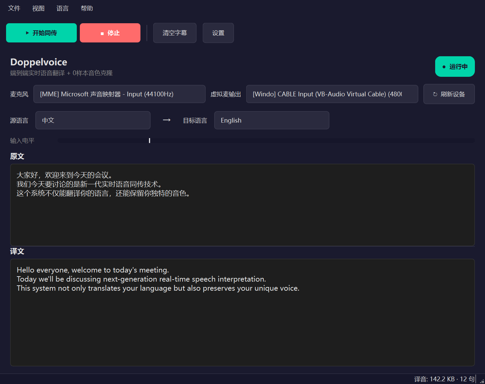

# Doppelvoice

> **你的声音，跨越语言。**
> 端到端实时语音翻译 + 0 样本音色克隆。对方在 Zoom / 腾讯会议 / 微信电话 / OBS 等任何接受麦克风的软件里，都能听到**你音色的英文**。
>
> _基于字节豆包同声传译 2.0（Seed LiveInterpret 2.0）模型。_

[English](README.md) · [架构设计](docs/zh/ARCHITECTURE.md) · [安装使用](docs/zh/SETUP.md) · [故障排查](docs/zh/TROUBLESHOOTING.md)

[]()
[](https://www.python.org/downloads/)
[](LICENSE)
[]()

---

## 它做什么

```
你说中文  ─►  Doppelvoice  ─►  对方听到你音色的英文
 ┌──────┐    ┌─────────┐    ┌────────────────────────┐
 │ 麦克风 │───►│ 豆包同传 │───►│虚拟麦 → Zoom/腾讯会议… │
 └──────┘    │  2.0    │    └────────────────────────┘
            └─────────┘
```

端到端延迟约 2.5–3 秒。字幕逐字流式输出，音色随你说话被零样本克隆。

## 特性

- 🎙 **端到端语音到语音** — 不需要分别接 STT / MT / TTS 三段
- 🗣 **0 样本音色克隆** — 模型边采边克隆，不用预录
- ⚡ **~2.5 秒延迟** — 工业级实时性
- 🪟 **Windows 原生 GUI**（PySide6）+ 中英双语实时字幕
- 🔌 **通用兼容** — 任何能选麦克风的软件都能用
- 🔁 **自动重连** + 指数退避 + 致命错误识别
- 🔒 **默认零落盘** — 译音和字幕都不写硬盘，除非你显式打开
- 🛠 **可调参数** — 采样率、jitter buffer、RMS 门限、speaker_id 全可调

## 演示



## 快速开始

### 1. 装 [VB-Audio Virtual Cable](https://vb-audio.com/Cable/)（必须，免费）

下载 → **右键 `VBCABLE_Setup_x64.exe`** → 以管理员运行 → 点 **Install Driver** → **重启**。

### 2. 获取豆包 API 密钥

1. 注册[火山引擎控制台](https://console.volcengine.com/speech/app)
2. 开通 **同声传译 2.0**（付费服务）
3. 在密钥页复制 `APP_KEY` 和 `ACCESS_KEY`

### 3. 克隆 & 安装

```cmd
git clone https://github.com/<你的用户名>/Doppelvoice.git
cd Doppelvoice
python -m venv .venv
.venv\Scripts\pip install -r requirements.txt
```

### 4. 配置

```cmd
copy .env.example .env
notepad .env
```

```dotenv
DOUBAO_APP_KEY=你的AppKey
DOUBAO_ACCESS_KEY=你的AccessKey
DOUBAO_RESOURCE_ID=volc.service_type.10053
```

### 5. 自检 & 启动

```cmd
check.bat        :: 自检：设备 + API 鉴权 + StartSession
gui.bat          :: 启动 GUI
run.bat          :: 命令行模式
```

会议软件里：麦克风选 **`CABLE Output (VB-Audio Virtual Cable)`**。

## 命令行

```cmd
run.bat                              :: 启动同传（CLI）
run.bat --gui                        :: 启动 GUI
run.bat --check                      :: 自检
run.bat --list-devices               :: 列音频设备
run.bat --source en --target zh      :: 反向（英→中）
run.bat --jitter-ms 80               :: 低延迟（更易抖动）
run.bat --log-level DEBUG            :: 详细日志
```

## 配置项

默认值都合理。需要时在 `.env` 或命令行覆盖。

| 变量 | 默认 | 说明 |
|---|---|---|
| `DOUBAO_APP_KEY` / `DOUBAO_ACCESS_KEY` | _必填_ | 火山引擎控制台获取 |
| `DOUBAO_RESOURCE_ID` | `volc.service_type.10053` | 同传 2.0 服务 ID |
| `SOURCE_LANG` / `TARGET_LANG` | `zh` / `en` | `zh` 或 `en` |
| `MODE` | `s2s` | `s2s`（语音→语音）或 `s2t`（语音→文本） |
| `SPEAKER_ID` | _空_ | 豆包 `ReqParams.speaker_id`（实验性） |
| `INPUT_DEVICE` / `OUTPUT_DEVICE` | _自动_ | 设备名子串匹配 |
| `LOG_LEVEL` | `INFO` | `DEBUG` 详细模式 |
| `DUMP_AUDIO` | `false` | 译音 ogg 落盘（仅调试用） |
| `LOG_SUBTITLE` | `false` | 字幕文本写入日志（仅调试用） |

## 架构

```
src/doppelvoice/
├── engine/        # 豆包 AST 2.0 protobuf WebSocket 客户端
├── audio/         # PortAudio (sounddevice) 采集 + 播放 + ogg/opus 解码
├── pipeline/      # asyncio 编排：采集 → ws → 解码 → 播放
├── gui/           # PySide6 + qasync
├── cli.py
└── config.py
```

完整协议细节见 [docs/zh/ARCHITECTURE.md](docs/zh/ARCHITECTURE.md)。

## 测试环境

- Windows 10 / 11 x64
- Python 3.10–3.12
- VB-Audio Virtual Cable 1.0.4 (Driver Pack 43)
- Zoom、腾讯会议、微信电话、Google Meet (Chrome)、OBS

## 已知限制

1. **音色克隆质量受麦克风影响**。AirPods 蓝牙 HFP（16kHz 窄带电话模式）效果差，建议有线/USB 麦或笔记本内置麦
2. **端到端延迟下限 ≈ 2.5 秒**，是模型的硬天花板（[Seed LiveInterpret 2.0 论文](https://arxiv.org/abs/2507.17527)），本地处理 < 500 ms
3. **音色表达性**比火山控制台 demo 略弱（控制台走不同的 BFF 端点带额外韵律处理）
4. **整句解码** ogg_opus 比 PCM 流多约 500 ms 延迟（API 目前不响应 PCM 输出）

## 隐私

- API 密钥只在 `.env`（已 gitignore）
- 译音和字幕**默认不落盘**
- `DUMP_AUDIO=1` / `LOG_SUBTITLE=1` 仅调试用
- 所有音频经过字节豆包 API。处理敏感内容前请阅读[服务条款](https://www.volcengine.com/docs/82379/1394617)

## 贡献

欢迎 PR。见 [CONTRIBUTING.md](CONTRIBUTING.md)。

## 许可

[MIT](LICENSE)。

## 致谢

- [字节 Seed LiveInterpret 2.0](https://seed.bytedance.com/en/seed_liveinterpret) — 底层翻译模型
- [kizuna-ai-lab/sokuji](https://github.com/kizuna-ai-lab/sokuji) — protobuf 逆向参考
- [VB-Audio Virtual Cable](https://vb-audio.com/Cable/) — Windows 虚拟音频
